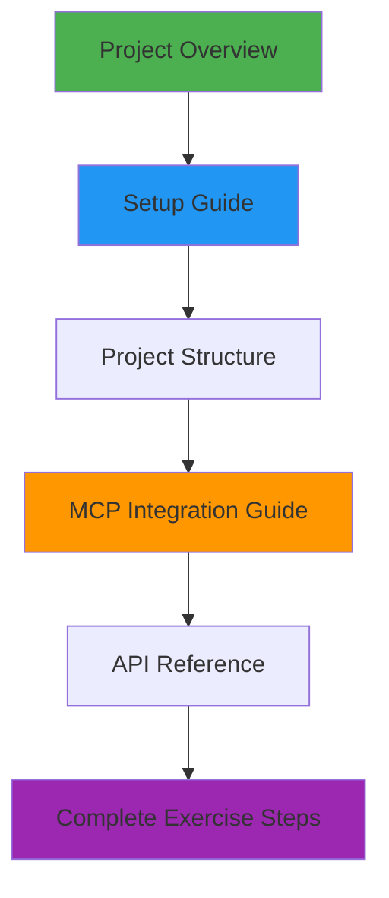
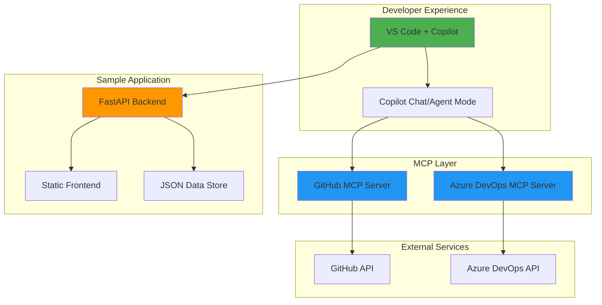

# Skills: Integrate MCP with GitHub Copilot - Wiki Home

<div align="center">


**Learn to expand GitHub Copilot's capabilities with Model Context Protocol**

[](https://skills.github.com/)
[](../LICENSE)
[](https://www.python.org/)
[](https://fastapi.tiangolo.com/)
[](https://modelcontextprotocol.io/)

</div>

## 🎯 Welcome

Welcome to the **Skills: Integrate MCP with GitHub Copilot** documentation! This interactive learning exercise teaches you how to use **Model Context Protocol (MCP)** to connect GitHub Copilot with external services, enabling powerful AI-assisted workflows.

### What You'll Learn

- 🔌 **Connect MCP Servers** to GitHub Copilot
- 🤖 **Use Agent Mode** for complex multi-step tasks
- 🔄 **Integrate Services** like GitHub and Azure DevOps
- 🛠️ **Automate Workflows** with AI assistance
- 📝 **Manage Issues** and code from Copilot Chat

### What You'll Build

A complete understanding of MCP integration through a sample **Mergington High School Activities Management System** - a FastAPI web application that demonstrates real-world usage patterns.

---

## 📖 Documentation Guide

### Getting Started

| Document | Description | Start Here |
|----------|-------------|------------|
| **[Project Overview](PROJECT_OVERVIEW.md)** | High-level introduction to the project, learning objectives, and key technologies | ⭐ **Start Here** |
| **[Setup Guide](SETUP_GUIDE.md)** | Step-by-step instructions to set up your development environment | ✅ **Do This First** |
| **[Project Structure](PROJECT_STRUCTURE.md)** | Detailed breakdown of files, directories, and component interactions | 📁 Reference |

### Core Documentation

| Document | Description | Best For |
|----------|-------------|----------|
| **[MCP Integration Guide](MCP_INTEGRATION.md)** | Complete guide to using MCP with GitHub Copilot | 🔌 MCP Setup |
| **[API Reference](API_REFERENCE.md)** | Detailed API endpoint documentation with examples | 🔗 API Usage |
| **[MCP Sync Guide](MCP_SYNC_GUIDE.md)** | Azure DevOps integration guide (Chinese) | 🔄 ADO Integration |

### Learning Path

Follow this sequence for the best learning experience:



---

## 🚀 Quick Start

### 1. Create Your Environment

**Option A: GitHub Codespaces (Recommended)**

[](https://codespaces.new/MelodyToGit/skills-integrate-mcp-with-copilot?quickstart=1)

**Option B: Local Development**
```bash
git clone https://github.com/MelodyToGit/skills-integrate-mcp-with-copilot.git
cd skills-integrate-mcp-with-copilot
code .
# Then: "Reopen in Container"
```

### 2. Configure MCP

Create `.vscode/mcp.json`:
```json
{
  "servers": {
    "github": {
      "type": "http",
      "url": "https://api.githubcopilot.com/mcp/"
    }
  }
}
```

### 3. Start the Application

Press **F5** or use the Run and Debug panel.

### 4. Begin Learning

Open `.github/steps/1-step.md` and follow the exercise!

---

## 🏗️ Project Architecture

### High-Level Overview



### Technology Stack

#### Frontend
- **HTML5** - Structure
- **CSS3** - Styling
- **JavaScript (ES6+)** - Interactivity
- **Fetch API** - HTTP requests

#### Backend
- **Python 3.13** - Programming language
- **FastAPI** - Modern web framework
- **Uvicorn** - ASGI server
- **JSON** - Data persistence

#### Development Tools
- **VS Code** - IDE
- **GitHub Copilot** - AI assistant
- **Dev Containers** - Consistent environment
- **GitHub Actions** - Automation

#### Integration
- **Model Context Protocol (MCP)** - AI tool integration
- **GitHub MCP Server** - GitHub API access
- **Azure DevOps MCP Server** - ADO API access

---

## 📁 Repository Structure

```
skills-integrate-mcp-with-copilot/
│
├── 📁 .devcontainer/          # Dev container with Python + Node.js
├── 📁 .github/                # Exercise workflows and steps
│   ├── 📁 steps/              # Learning instructions
│   └── 📁 workflows/          # Automation (CI/CD)
├── 📁 .vscode/                # VS Code + MCP configuration
│   ├── launch.json            # Debug settings
│   └── mcp.json               # MCP server config
├── 📁 docs/                   # 📚 You are here!
│   ├── HOME.md                # This file
│   ├── PROJECT_OVERVIEW.md    # Introduction
│   ├── PROJECT_STRUCTURE.md   # File structure
│   ├── SETUP_GUIDE.md         # Setup instructions
│   ├── API_REFERENCE.md       # API documentation
│   ├── MCP_INTEGRATION.md     # MCP guide
│   └── MCP_SYNC_GUIDE.md      # ADO integration (Chinese)
├── 📁 src/                    # Application source code
│   ├── app.py                 # FastAPI application
│   ├── activities.json        # Data storage
│   └── 📁 static/             # Frontend files
├── LICENSE                    # MIT License
├── README.md                  # Welcome message
└── requirements.txt           # Python dependencies
```

---

## 🎓 Learning Exercises

The project includes a structured learning path with 4 main steps:

### Step 1: MCP Introduction & Setup
**Topics:** Environment setup, MCP basics, GitHub MCP server configuration

**Duration:** ~30 minutes

**File:** `.github/steps/1-step.md`

### Step 2: Agent Mode & GitHub MCP
**Topics:** Using Agent Mode, searching repositories, creating issues

**Duration:** ~45 minutes

**File:** `.github/steps/2-step.md`

### Step 3: Advanced MCP Features
**Topics:** Complex workflows, multi-tool operations, code analysis

**Duration:** ~45 minutes

**File:** `.github/steps/3-step.md`

### Step 4: Review & Completion
**Topics:** Review learnings, best practices, next steps

**Duration:** ~15 minutes

**File:** `.github/steps/4-step.md`

---

## 🔧 Sample Application

### Mergington High School Activities System

A simple but complete web application demonstrating:

**Features:**
- ✅ View extracurricular activities
- ✅ Sign up for activities
- ✅ Unregister from activities
- ✅ Persistent data storage
- ✅ RESTful API design

**Activities Included:**
1. Chess Club
2. Programming Class
3. Gym Class
4. Soccer Team
5. Basketball Team
6. Art Club
7. Drama Club
8. Math Club
9. Debate Team

**Try it:**
```bash
# Start the server
python src/app.py

# Open browser
http://localhost:8000
```

---

## 🔌 MCP Servers

### GitHub MCP Server

**Capabilities:**
- Search repositories
- Read repository contents
- Manage issues and pull requests
- Create branches
- Search code

**Configuration:**
```json
{
  "servers": {
    "github": {
      "type": "http",
      "url": "https://api.githubcopilot.com/mcp/"
    }
  }
}
```

### Azure DevOps MCP Server

**Capabilities:**
- Query work items
- Create and update work items
- Search across projects
- Add comments
- Batch operations

**Configuration:**
```json
{
  "servers": {
    "ado": {
      "type": "stdio",
      "command": "npx",
      "args": ["-y", "@azure-devops/mcp", "${input:ado_org}"],
      "env": {
        "AZURE_DEVOPS_EXT_PAT": "${input:ado_pat}"
      }
    }
  }
}
```

---

## 💡 Key Concepts

### Model Context Protocol (MCP)

**MCP is "USB-C for AI"** - a standardized protocol that:
- Connects AI assistants to external services
- Provides a consistent interface for tool calling
- Enables complex, multi-step workflows
- Reduces custom integration code

### Agent Mode

**Agent Mode** enables Copilot to:
- Plan multi-step tasks autonomously
- Call multiple tools in sequence
- Make decisions based on results
- Handle complex workflows end-to-end

### Tool Calling

**How it works:**
1. Developer sends a prompt to Copilot
2. Copilot analyzes available MCP tools
3. Copilot selects appropriate tool(s)
4. Copilot requests permission from developer
5. Tool is called with generated parameters
6. Result is returned and processed
7. Copilot provides final response

---

## 🎯 Use Cases

### For Developers

- **Code Search**: Find examples across GitHub repositories
- **Issue Management**: Create and triage issues from Chat
- **Code Review**: Compare implementations with other projects
- **Documentation**: Generate docs from similar projects
- **Refactoring**: Get suggestions based on best practices

### For Teams

- **Work Item Sync**: Synchronize ADO and GitHub
- **Automated Triage**: AI-assisted issue categorization
- **Cross-Platform**: Unified interface for multiple services
- **Knowledge Sharing**: Learn from similar projects
- **Workflow Automation**: Reduce manual tasks

---

## 📚 Additional Resources

### Official Documentation
- [Model Context Protocol](https://modelcontextprotocol.io/)
- [GitHub Copilot Docs](https://docs.github.com/copilot)
- [FastAPI Documentation](https://fastapi.tiangolo.com/)
- [VS Code Dev Containers](https://code.visualstudio.com/docs/devcontainers/containers)

### MCP Ecosystem
- [GitHub MCP Server](https://github.com/github/github-mcp-server)
- [Azure DevOps MCP](https://www.npmjs.com/package/@azure-devops/mcp)
- [MCP Servers Repository](https://github.com/modelcontextprotocol/servers)

### GitHub Skills
- [All GitHub Skills](https://skills.github.com/)
- [Getting Started with Copilot](https://github.com/skills/getting-started-with-github-copilot)

---

## 🤝 Contributing

This is a learning exercise, but suggestions are welcome!

**To contribute:**
1. Fork the repository
2. Create a feature branch
3. Make your changes
4. Submit a pull request

---

## ❓ FAQ

### Q: Do I need a Copilot subscription?
**A:** Yes, GitHub Copilot (Individual, Business, or Enterprise) is required.

### Q: Can I use this locally without Codespaces?
**A:** Yes! Use the Dev Container locally with Docker and VS Code.

### Q: Do I need Azure DevOps?
**A:** No, the GitHub MCP server alone is sufficient to complete the exercise.

### Q: Is this project suitable for production?
**A:** The sample app is for learning. MCP patterns are production-ready.

### Q: Can I build my own MCP server?
**A:** Absolutely! Check the [MCP documentation](https://modelcontextprotocol.io/docs/building-servers) for guides.

### Q: What if I encounter issues?
**A:** Check the [Setup Guide](SETUP_GUIDE.md) troubleshooting section or open an issue.

---

## 📄 License

This project is licensed under the **MIT License**.

Copyright © 2025 GitHub Skills

See [LICENSE](../LICENSE) for full details.

---

## 🎉 Ready to Start?

<div align="center">

### Choose Your Path

| I want to... | Go to... |
|--------------|----------|
| Understand the project | [Project Overview](PROJECT_OVERVIEW.md) ⭐ |
| Set up my environment | [Setup Guide](SETUP_GUIDE.md) 🚀 |
| Learn about MCP | [MCP Integration Guide](MCP_INTEGRATION.md) 🔌 |
| See the API docs | [API Reference](API_REFERENCE.md) 📖 |
| Explore the code | [Project Structure](PROJECT_STRUCTURE.md) 🏗️ |
| Start the exercise | `.github/steps/1-step.md` 🎓 |

**Happy Learning!** 🌟

</div>
