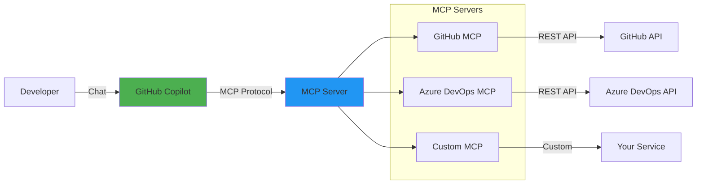
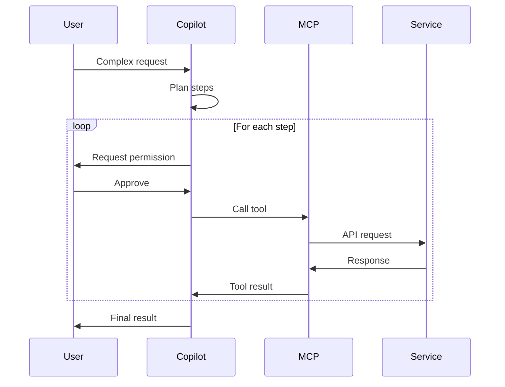

# MCP Integration Guide

This guide explains how Model Context Protocol (MCP) is integrated into this project and how to use it effectively with GitHub Copilot.

## What is MCP?

**Model Context Protocol (MCP)** is an open protocol that standardizes how AI applications integrate with external data sources and tools. Think of it as "USB-C for AI" - a universal connector that allows GitHub Copilot to interact with various services through a consistent interface.

### Key Concepts

- **MCP Server**: A service that exposes tools and resources to AI assistants
- **MCP Client**: An application (like GitHub Copilot) that consumes MCP servers
- **Tools**: Functions that the AI can call to perform actions
- **Resources**: Data sources the AI can read from
- **Prompts**: Reusable prompt templates

## MCP Architecture



## MCP Configuration

### File Location

MCP servers are configured in `.vscode/mcp.json` in your workspace.

### Basic Structure

```json
{
  "inputs": [],
  "servers": {}
}
```

### Configuration Components

#### 1. Inputs

Define dynamic values that can be prompted from users:

```json
"inputs": [
  {
    "id": "unique_id",
    "type": "promptString",
    "description": "User-friendly description",
    "password": false
  }
]
```

**Input Types:**
- `promptString`: Text input
- `promptString` with `"password": true`: Password input (hidden)

#### 2. Servers

Define MCP servers and how to connect to them:

```json
"servers": {
  "server_name": {
    "type": "http|stdio",
    "url": "...",         // For HTTP servers
    "command": "...",     // For stdio servers
    "args": [],           // Command arguments
    "env": {}             // Environment variables
  }
}
```

**Server Types:**
- **HTTP**: RESTful MCP servers (like GitHub's)
- **stdio**: Process-based servers that communicate via standard input/output

## GitHub MCP Server

### Configuration

```json
{
  "servers": {
    "github": {
      "type": "http",
      "url": "https://api.githubcopilot.com/mcp/"
    }
  }
}
```

### Setup Steps

1. **Create the file** `.vscode/mcp.json`
2. **Add the configuration** above
3. **Click "Start"** button in the file
4. **Authenticate** with GitHub when prompted
5. **Verify** the server shows as "Running"

### Available Tools

The GitHub MCP server provides tools for:

#### Repository Operations
- `search_repositories`: Find repositories on GitHub
- `get_repository`: Get repository details
- `get_file_contents`: Read files from repositories
- `search_code`: Search code across GitHub

#### Issue Management
- `list_issues`: Get issues from a repository
- `create_issue`: Create new issues
- `update_issue`: Modify existing issues
- `get_issue`: Get issue details
- `search_issues`: Search issues with filters

#### Pull Request Operations
- `list_pull_requests`: List PRs in a repository
- `create_pull_request`: Create new PRs
- `get_pull_request`: Get PR details

#### Branch Operations
- `list_branches`: List repository branches
- `get_branch`: Get branch details
- `create_branch`: Create new branches

### Usage Examples

#### Example 1: Search for Repositories

**Prompt:**
```
@workspace Search for repositories about student activity management
```

**What happens:**
1. Copilot recognizes the need for the `search_repositories` tool
2. Constructs the query parameters
3. Calls the GitHub MCP server
4. Receives and presents the results

#### Example 2: Create an Issue

**Prompt:**
```
@workspace Create an issue titled "Add calendar view" with description "Students need to see all activities in a calendar format"
```

**What happens:**
1. Copilot uses `create_issue` tool
2. Asks for permission to create the issue
3. You review and approve
4. Issue is created in your repository

#### Example 3: Read Code from Another Repo

**Prompt:**
```
@workspace Look at the authentication code in the repository "example/auth-demo" and compare it to our project
```

**What happens:**
1. Copilot uses `get_repository` to find the repo
2. Uses `search_code` or `get_file_contents` to read relevant files
3. Analyzes and compares with your code
4. Provides insights

## Azure DevOps MCP Server

### Configuration

```json
{
  "inputs": [
    {
      "id": "ado_org",
      "type": "promptString",
      "description": "Azure DevOps organization name (e.g. 'contoso')"
    },
    {
      "id": "ado_pat",
      "type": "promptString",
      "description": "Azure DevOps Personal Access Token",
      "password": true
    }
  ],
  "servers": {
    "ado": {
      "type": "stdio",
      "command": "npx",
      "args": ["-y", "@azure-devops/mcp", "${input:ado_org}"],
      "env": {
        "AZURE_DEVOPS_EXT_PAT": "${input:ado_pat}"
      }
    }
  }
}
```

### Prerequisites

- **Node.js** 18 or later
- **Azure DevOps account**
- **Personal Access Token (PAT)** with work item read/write permissions

### Setup Steps

1. **Get Azure DevOps PAT**:
   - Go to Azure DevOps → User Settings → Personal Access Tokens
   - Create token with "Work Items (Read & Write)" scope

2. **Add configuration** to `.vscode/mcp.json`

3. **Start the server**:
   - Click "Start" button
   - Enter organization name when prompted
   - Enter PAT when prompted

4. **Verify** server is running

### Available Tools

#### Work Item Operations
- `mcp_ado_wit_my_work_items`: Get your work items
- `mcp_ado_wit_get_work_item`: Get single work item details
- `mcp_ado_wit_get_work_items_batch_by_ids`: Get multiple work items
- `mcp_ado_wit_create_work_item`: Create new work item
- `mcp_ado_wit_update_work_item`: Update work item
- `mcp_ado_wit_add_work_item_comment`: Add comment to work item

#### Search Operations
- `mcp_ado_search_workitem`: Search for work items

### Usage Examples

#### Example 1: List Your Work Items

**Prompt:**
```
@workspace Show me my recent work items from Azure DevOps project "MyProject"
```

**Tool Called:**
```json
{
  "tool": "mcp_ado_wit_my_work_items",
  "params": {
    "project": "MyProject",
    "top": 10
  }
}
```

#### Example 2: Sync ADO to GitHub

**Prompt:**
```
@workspace Get all "Ready for Dev" bugs from Azure DevOps project "MyProject" and create GitHub issues for the top 5
```

**What happens:**
1. Uses `mcp_ado_search_workitem` to find bugs
2. Uses `mcp_ado_wit_get_work_items_batch_by_ids` to get details
3. Uses GitHub MCP's `create_issue` to create issues
4. Links back to ADO work items

#### Example 3: Create Work Item

**Prompt:**
```
@workspace Create a bug in Azure DevOps project "MyProject":
Title: Login button not working
Description: Users cannot log in on mobile devices
```

**Tool Called:**
```json
{
  "tool": "mcp_ado_wit_create_work_item",
  "params": {
    "project": "MyProject",
    "workItemType": "Bug",
    "fields": {
      "System.Title": "Login button not working",
      "System.Description": "Users cannot log in on mobile devices"
    }
  }
}
```

## Using Agent Mode

### What is Agent Mode?

**Agent Mode** allows GitHub Copilot to:
- Autonomously plan multi-step tasks
- Call multiple MCP tools in sequence
- Make decisions based on tool results
- Handle complex workflows

### Enabling Agent Mode

1. Open Copilot Chat panel
2. Look for the mode selector dropdown
3. Select **"Agent"** mode
4. Verify MCP tools are available (🛠️ icon)


### Agent Mode vs Chat Mode

| Feature | Chat Mode | Agent Mode |
|---------|-----------|------------|
| Tool Calling | Manual/Limited | Automatic |
| Multi-step Tasks | No | Yes |
| Planning | No | Yes |
| Permission Prompts | Few | More frequent |
| Best For | Simple questions | Complex workflows |

### Agent Mode Workflow



## Best Practices

### 1. Permission Management

**Always review** permission requests before approving:
- Check what tool is being called
- Verify the parameters
- Ensure the action is expected

**Example permission prompt:**
```
🔒 GitHub Copilot wants to:
   Call: create_issue
   Repository: MelodyToGit/skills-integrate-mcp-with-copilot
   Title: "Add calendar view"
   
   [Review] [Continue] [Cancel]
```

### 2. Effective Prompts

**Be specific:**
✅ "Search for Python FastAPI projects with user authentication and create issues for the top 3 features we're missing"

❌ "Find some stuff"

**Include context:**
✅ "@workspace Look at our activities.json file and suggest improvements based on similar projects"

❌ "Improve the code"

**Break down complex tasks:**
✅ "First, search for school management systems. Then, analyze the top result. Finally, create issues for new features."

❌ "Do everything"

### 3. Tool Hints

You can hint at specific tools:

```
@workspace #search_repositories Find activity management systems
@workspace #create_issue Create an issue for adding a calendar view
@workspace #get_file_contents Show me the app.py file
```

### 4. Context Management

**Clear context** between unrelated tasks:
- Click the "New Chat" (➕) button
- Prevents context pollution
- Improves tool selection accuracy

**Close unnecessary files:**
- Reduces context size
- Faster tool calls
- Better results

## Troubleshooting

### Server Won't Start

**Symptoms:**
- Start button doesn't work
- Error messages in Output panel

**Solutions:**
1. Check Node.js version: `node --version` (need 18+)
2. Check network connectivity
3. Restart VS Code
4. Try: Output → Model Context Protocol → check logs

### Authentication Fails

**For GitHub MCP:**
1. Verify you're logged into GitHub in VS Code
2. Try: Accounts → Sign out → Sign in again
3. Check GitHub Copilot subscription is active

**For Azure DevOps MCP:**
1. Verify PAT is valid and not expired
2. Check PAT has correct permissions
3. Verify organization name is correct

### Tools Not Available

**Check:**
1. Server is running (green indicator in mcp.json)
2. Agent mode is enabled
3. Click 🛠️ icon to see available tools
4. Restart the server

### Permission Denied

**Common causes:**
- GitHub PAT lacks required scopes
- Azure DevOps PAT has insufficient permissions
- Rate limiting

**Solutions:**
- Regenerate PAT with correct permissions
- Wait if rate limited
- Check API status pages

## Advanced Topics

### Custom MCP Servers

You can create your own MCP servers:

```json
{
  "servers": {
    "custom": {
      "type": "stdio",
      "command": "python",
      "args": ["path/to/your/mcp_server.py"],
      "env": {
        "API_KEY": "your_api_key"
      }
    }
  }
}
```

### Environment Variables

Use `${input:variable_name}` to reference inputs:

```json
{
  "inputs": [
    {"id": "api_key", "type": "promptString", "password": true}
  ],
  "servers": {
    "service": {
      "env": {
        "API_KEY": "${input:api_key}"
      }
    }
  }
}
```

### Multiple Servers

You can configure multiple servers simultaneously:

```json
{
  "servers": {
    "github": { /* GitHub config */ },
    "ado": { /* Azure DevOps config */ },
    "jira": { /* Jira config */ },
    "custom": { /* Your custom server */ }
  }
}
```

Copilot will intelligently choose which server(s) to use based on your request.

## Security Considerations

### Secrets Management

❌ **Never commit** `mcp.json` with hardcoded secrets:
```json
{
  "env": {
    "API_KEY": "actual_secret_here"  // DON'T DO THIS
  }
}
```

✅ **Always use inputs** for sensitive data:
```json
{
  "inputs": [
    {"id": "api_key", "type": "promptString", "password": true}
  ],
  "servers": {
    "service": {
      "env": {"API_KEY": "${input:api_key}"}
    }
  }
}
```

### Tool Permissions

MCP servers can:
- Read your repositories
- Create issues and PRs
- Modify files (if implemented)
- Access external services

**Always:**
- Review tool calls before approving
- Use servers from trusted sources
- Understand what each tool does

## Resources

- [Model Context Protocol Official Site](https://modelcontextprotocol.io/)
- [MCP Specification](https://spec.modelcontextprotocol.io/)
- [GitHub MCP Server](https://github.com/github/github-mcp-server)
- [Azure DevOps MCP Server](https://www.npmjs.com/package/@azure-devops/mcp)
- [MCP Servers List](https://github.com/modelcontextprotocol/servers)
- [Building MCP Servers](https://modelcontextprotocol.io/docs/building-servers)

---

**Next Steps:**
- Try the exercises in `.github/steps/`
- Experiment with different prompts
- Build your own MCP server
- Share your experience!
