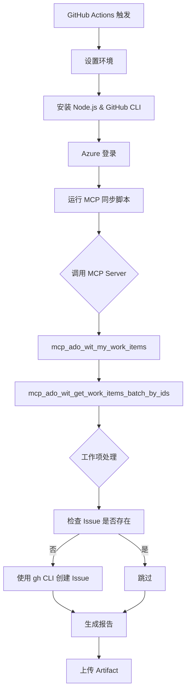

# 🔄 使用 Azure MCP 同步 ADO 到 GitHub Issues

**通过 GitHub Copilot + Azure MCP 实现交互式同步**

## 🎯 核心理解

**重要**: Azure MCP Server 通过 `mcp.json` 配置，**只能在 VS Code + Copilot 环境中使用**。

### MCP 的工作方式

1. ✅ **在 Copilot Chat 中** - 可以调用 MCP 工具（如 `mcp_ado_wit_my_work_items`）
2. ❌ **在独立脚本中** - 无法直接使用 MCP（需要通过 stdio 通信，非常复杂）
3. ✅ **自动化方案** - 使用传统 REST API（`.github/workflows/pilot-sync-ado.yml`）

### 与传统方案的对比

| 特性 | MCP 方案（交互式） | 传统 REST API（自动化） |
|------|---------|--------------|
| **使用场景** | Copilot Chat 中手动操作 | GitHub Actions 自动运行 |
| **协议** | Model Context Protocol | HTTP REST API |
| **配置** | `mcp.json` | Secrets + 代码 |
| **优势** | 与 AI 深度集成、标准化 | 完全自动化、稳定可靠 |
| **劣势** | 需要手动触发 | 需要自己实现所有逻辑 |

## 🔌 MCP 架构

```
用户在 Copilot Chat 中输入请求
    ↓
GitHub Copilot 解析意图
    ↓
读取 .vscode/mcp.json 配置
    ↓
启动 npx @azure-devops/mcp (MCP Server)
    ↓
通过 stdio 协议通信
    ↓
MCP Server 调用 Azure DevOps API
    ↓
返回结果给 Copilot
    ↓
Copilot 处理数据并执行后续操作（如创建 GitHub Issue）
```

## 🚀 如何使用 Azure MCP

### 在 Copilot Chat 中使用

**示例 1: 查询工作项**
```
@workspace 使用 Azure MCP 查询 EMR-DigMod 项目中我最近活动的工作项，显示前5个
```

Copilot 会调用：
- `mcp_ado_wit_my_work_items` 
- `mcp_ado_wit_get_work_items_batch_by_ids`

**示例 2: 同步到 GitHub**
```
@workspace 查询 ADO 中状态为 "Ready for Dev" 的 Bug，
将前3个同步到 GitHub Issues，添加标签 ado-synced 和 bug
```

Copilot 会：
1. 调用 MCP 查询 ADO
2. 获取工作项详情
3. 使用 GitHub API 创建 Issues

**示例 3: 创建工作项**
```
@workspace 在 ADO 项目 EMR-DigMod 中创建一个 Bug：
标题：测试 MCP 创建
描述：这是通过 Copilot + MCP 创建的测试 Bug
```

Copilot 会调用：
- `mcp_ado_wit_create_work_item`

## ⚙️ 快速开始

### 前置要求

1. **Node.js** (用于运行 MCP Server)
2. **GitHub CLI** (用于创建 Issues)
3. **Azure CLI** (已登录)
4. **环境变量**:
   - `AZURE_DEVOPS_EXT_PAT` - ADO PAT Token
   - `ADO_ORG` - 组织名
   - `GITHUB_TOKEN` - GitHub Token

### 本地测试

```bash
# 1. 确保已登录 Azure
az login

# 2. 设置环境变量
export AZURE_DEVOPS_EXT_PAT="your_ado_pat"
export ADO_ORG="EmersonAutomationSolutions"
export ADO_PROJECT="EMR-DigMod"
export GITHUB_TOKEN="your_github_token"
export GITHUB_REPOSITORY="MelodyToGit/skills-integrate-mcp-with-copilot"

# 3. 登录 GitHub CLI
gh auth login --with-token <<< "$GITHUB_TOKEN"

# 4. 运行 MCP 同步脚本
python scripts/sync_ado_to_github_mcp.py
```

### GitHub Actions 部署

工作流已配置为使用 MCP 版本，只需：

1. **设置 Secrets**:
   - `ADO_PAT` - Azure DevOps PAT
   - `ADO_ORG` - 组织名称

2. **手动触发或等待定时运行**

## 🔧 MCP 调用示例

### 直接调用 MCP Server

```bash
# 查询工作项
echo '{
  "jsonrpc": "2.0",
  "id": 1,
  "method": "tools/call",
  "params": {
    "name": "mcp_ado_wit_my_work_items",
    "arguments": {
      "project": "EMR-DigMod",
      "top": 10
    }
  }
}' | npx -y @azure-devops/mcp EmersonAutomationSolutions
```

### Python 中调用

```python
import subprocess
import json

def call_mcp(tool_name, params):
    request = {
        "jsonrpc": "2.0",
        "id": 1,
        "method": "tools/call",
        "params": {
            "name": tool_name,
            "arguments": params
        }
    }
    
    result = subprocess.run(
        ['npx', '-y', '@azure-devops/mcp', 'YOUR_ORG'],
        input=json.dumps(request).encode(),
        capture_output=True
    )
    
    return json.loads(result.stdout.decode())

# 使用
response = call_mcp("mcp_ado_wit_my_work_items", {
    "project": "EMR-DigMod",
    "top": 20
})
```

## 📊 可用的 MCP 工具

脚本使用以下 MCP 工具：

| MCP 工具 | 功能 | 参数 |
|---------|------|------|
| `mcp_ado_wit_my_work_items` | 查询我的工作项 | project, top, type |
| `mcp_ado_search_workitem` | 搜索工作项 | project, searchText, workItemType |
| `mcp_ado_wit_get_work_items_batch_by_ids` | 批量获取详情 | project, ids |
| `mcp_ado_wit_get_work_item` | 获取单个工作项 | project, id |
| `mcp_ado_wit_create_work_item` | 创建工作项 | project, workItemType, fields |
| `mcp_ado_wit_add_work_item_comment` | 添加评论 | project, workItemId, comment |

## 🎨 同步流程



## ✨ MCP 的优势

### 1. **标准化接口**
- 统一的工具调用方式
- 与 GitHub Copilot 原生集成
- 支持未来扩展

### 2. **更好的认证**
- 支持 Azure 身份验证
- 支持 Service Principal
- 更安全的凭证管理

### 3. **AI 友好**
- Copilot 可以直接理解和使用
- 工具元数据完整
- 支持复杂查询

### 4. **可维护性**
- 工具定义清晰
- 错误处理标准化
- 版本管理简单

## 🐛 故障排查

### MCP Server 启动失败
```bash
# 检查 Node.js 版本
node --version  # 需要 >= 18

# 手动测试 MCP Server
npx -y @azure-devops/mcp EmersonAutomationSolutions
```

### 认证失败
```bash
# 确保已登录 Azure
az login
az account show

# 检查 PAT 是否设置
echo $AZURE_DEVOPS_EXT_PAT
```

### GitHub CLI 问题
```bash
# 检查 gh 版本
gh --version

# 重新认证
gh auth login
```

## 📝 示例输出

```
================================================================================
🚀 使用 Azure MCP 同步 ADO 工作项到 GitHub Issues
📂 项目: EMR-DigMod
🔌 MCP Server: @azure-devops/mcp
================================================================================

🔍 通过 MCP 查询工作项...
✅ 找到 15 个工作项

📥 获取 10 个工作项的详情...
✅ 获取了 10 个工作项详情

📝 开始同步 10 个工作项...

➕ ADO-19573693: PRE_SIT_EMR_FCTL_PRV - Tools Page...
  ✅ 创建 Issue: https://github.com/MelodyToGit/repo/issues/42

⏭️  ADO-19904086: PRE_SIT_EMR_STG_MSOL... (已存在)

================================================================================
✨ 同步完成!
  ✅ 创建: 8
  ⏭️  跳过: 2
  ❌ 错误: 0
================================================================================
```

## 🔮 未来扩展

使用 MCP 可以轻松扩展功能：

- ✅ 双向同步（GitHub → ADO）
- ✅ 自动关联 PR 和工作项
- ✅ 同步评论和附件
- ✅ 自定义工作流状态映射
- ✅ 集成 AI 分析和建议

## 📚 相关资源

- [Model Context Protocol](https://modelcontextprotocol.io/)
- [Azure DevOps MCP Server](https://www.npmjs.com/package/@azure-devops/mcp)
- [GitHub CLI](https://cli.github.com/)
- [Azure CLI](https://docs.microsoft.com/cli/azure/)
