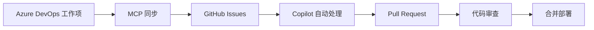

# 🎓 Mergington High School Management System

欢迎来到 **Mergington High School Management System** 项目！这是一个集成了 MCP (Model Context Protocol) 和 GitHub Copilot 的现代化高中管理系统。

## 📖 项目简介

这是一个使用 FastAPI 构建的高中课外活动管理系统，学生可以通过简洁的 Web 界面查看和报名参加各种课外活动。本项目展示了如何有效地集成 Azure DevOps 和 GitHub 的工作流程。

### 🎯 主要功能

- **活动浏览**：查看所有可用的课外活动及其详细信息
- **在线报名**：学生可以使用邮箱快速报名参加活动
- **取消报名**：灵活管理自己的活动参与
- **实时更新**：活动参与人员列表实时同步
- **响应式界面**：支持多设备访问

## 🏗️ 技术架构

### 后端技术栈
- **FastAPI**: 现代化的 Python Web 框架
- **Uvicorn**: 高性能 ASGI 服务器
- **JSON**: 轻量级数据持久化

### 前端技术栈
- **HTML5**: 语义化结构
- **CSS3**: 现代化样式设计
- **JavaScript**: 动态交互逻辑

### 集成工具
- **Azure DevOps MCP**: 工作项管理和同步
- **GitHub MCP**: 问题追踪和自动化
- **GitHub Copilot**: AI 辅助编码

## 📂 项目结构

```
skills-integrate-mcp-with-copilot/
├── src/
│   ├── app.py              # FastAPI 主应用
│   ├── activities.json     # 活动数据存储
│   ├── README.md           # 源码说明
│   └── static/
│       ├── index.html      # 前端界面
│       ├── styles.css      # 样式文件
│       └── app.js          # JavaScript 逻辑
├── .vscode/
│   └── mcp.json            # MCP 配置文件
├── docs/
│   └── PROJECT_INTRODUCTION.md  # 项目介绍文档
├── requirements.txt        # Python 依赖
├── LICENSE                 # MIT 许可证
└── README.md               # 项目说明
```

## 🚀 快速开始

### 环境要求
- Python 3.8+
- Node.js 和 npm (用于 MCP 工具)
- VS Code (推荐)

### 安装步骤

1. **克隆仓库**
   ```bash
   git clone https://github.com/MelodyToGit/skills-integrate-mcp-with-copilot.git
   cd skills-integrate-mcp-with-copilot
   ```

2. **安装 Python 依赖**
   ```bash
   pip install -r requirements.txt
   ```

3. **启动应用**
   ```bash
   cd src
   uvicorn app:app --reload
   ```

4. **访问应用**
   打开浏览器访问: http://localhost:8000

## 🔧 MCP 集成配置

### Azure DevOps MCP

1. **安装 MCP 服务器**
   ```bash
   npm install -g @azure-devops/mcp
   ```

2. **配置 `.vscode/mcp.json`**
   ```json
   {
     "inputs": [
       {
         "id": "ado_org",
         "type": "promptString",
         "description": "Azure DevOps organization name"
       },
       {
         "id": "ado_pat",
         "type": "promptString",
         "description": "Azure DevOps Personal Access Token",
         "password": true
       }
     ],
     "servers": {
       "github": {
         "type": "http",
         "url": "https://api.githubcopilot.com/mcp/"
       },
       "ado": {
         "type": "stdio",
         "command": "npx",
         "args": ["-y", "@azure-devops/mcp", "${input:ado_org}"],
         "env": {
           "AZURE_DEVOPS_EXT_PAT": "${input:ado_pat}"
         }
       }
     }
   }
   ```

3. **重新加载 VS Code** 并在 Copilot Chat 中使用 `@ado` 来访问 Azure DevOps

### 使用示例

在 Copilot Chat 中，你可以：
- `@ado 显示我的工作项` - 查看分配给你的任务
- `@ado 搜索 Bug` - 搜索特定类型的工作项
- `@ado 列出所有项目` - 查看组织中的所有项目

## 📋 API 文档

### 获取所有活动
```http
GET /activities
```

**响应示例:**
```json
{
  "Chess Club": {
    "description": "Strategic board game club for all skill levels",
    "schedule": "Thursdays at 3:30 PM in Room 204",
    "participants": ["student1@school.com", "student2@school.com"]
  },
  "Drama Club": {
    "description": "Theater and performance arts",
    "schedule": "Tuesdays and Fridays at 4:00 PM in Auditorium",
    "participants": ["student3@school.com"]
  }
}
```

### 报名参加活动
```http
POST /activities/{activity_name}/signup?email={student_email}
```

**参数:**
- `activity_name` (path): 活动名称
- `email` (query): 学生邮箱

**成功响应 (200):**
```json
{
  "message": "Signed up student@school.com for Chess Club"
}
```

**错误响应:**
- `404`: 活动不存在
- `400`: 学生已经报名

### 取消报名
```http
DELETE /activities/{activity_name}/unregister?email={student_email}
```

**参数:**
- `activity_name` (path): 活动名称
- `email` (query): 学生邮箱

**成功响应 (200):**
```json
{
  "message": "Unregistered student@school.com from Chess Club"
}
```

**错误响应:**
- `404`: 活动不存在
- `400`: 学生未报名此活动

## 🔄 完整工作流程

本项目展示了一个现代化的 DevOps 工作流：



### 详细步骤

1. **Azure DevOps**: 在 ADO 中创建和管理工作项
2. **MCP 同步**: 使用 MCP 工具将工作项同步到 GitHub Issues
3. **Copilot 分配**: 自动将 Issues 分配给 Copilot 进行处理
4. **代码生成**: Copilot 分析需求并生成代码
5. **Pull Request**: Copilot 创建 PR 提交更改
6. **审查合并**: 团队审查后合并到主分支
7. **持续迭代**: 循环优化和改进

## 🤝 贡献指南

我们欢迎所有形式的贡献！

### 如何贡献

1. **Fork 本仓库**
2. **创建特性分支**
   ```bash
   git checkout -b feature/AmazingFeature
   ```
3. **提交更改**
   ```bash
   git commit -m 'Add some AmazingFeature'
   ```
4. **推送到分支**
   ```bash
   git push origin feature/AmazingFeature
   ```
5. **开启 Pull Request**

### 代码规范

- 遵循 PEP 8 Python 代码风格
- 为新功能添加测试
- 更新相关文档
- 提交信息使用清晰的描述

## 📊 项目统计

- **语言**: Python, JavaScript, HTML, CSS
- **框架**: FastAPI
- **集成**: Azure DevOps, GitHub Copilot
- **许可**: MIT License

## 📜 许可证

本项目采用 MIT 许可证 - 详见 [LICENSE](../LICENSE) 文件

## 👥 团队与联系

### 维护者
- **Wang, MelodyW** - 主要开发者
- **组织**: EmersonAutomationSolutions

### 联系方式
- 📧 提交 Issue: [GitHub Issues](https://github.com/MelodyToGit/skills-integrate-mcp-with-copilot/issues)
- 💬 参与讨论: [GitHub Discussions](https://github.com/MelodyToGit/skills-integrate-mcp-with-copilot/discussions)
- 🐛 报告 Bug: 使用 Issue 模板

## 🎓 相关资源

### 学习资料
- [GitHub Skills](https://learn.github.com/skills) - GitHub 官方学习资源
- [FastAPI 文档](https://fastapi.tiangolo.com/) - FastAPI 完整文档
- [Model Context Protocol](https://modelcontextprotocol.io/) - MCP 协议规范
- [GitHub Copilot 文档](https://docs.github.com/en/copilot) - Copilot 使用指南
- [Azure DevOps 文档](https://learn.microsoft.com/en-us/azure/devops/) - ADO 官方文档

### 示例项目
- [FastAPI 示例](https://github.com/tiangolo/fastapi/tree/master/docs_src)
- [MCP 服务器示例](https://github.com/modelcontextprotocol/servers)

## 🚧 未来规划

- [ ] 添加用户认证系统
- [ ] 实现活动容量限制
- [ ] 添加活动评论功能
- [ ] 集成邮件通知
- [ ] 开发移动端应用
- [ ] 添加管理员后台
- [ ] 实现数据可视化仪表板
- [ ] 支持多语言国际化

## 🎉 致谢

感谢以下项目和工具：
- GitHub Skills 团队提供的学习资源
- FastAPI 社区的优秀框架
- Azure DevOps 团队的 MCP 集成
- GitHub Copilot 的 AI 辅助

---

⭐ **如果这个项目对你有帮助，请给我们一个星标！**

🔗 **快速链接**
- [主页](https://github.com/MelodyToGit/skills-integrate-mcp-with-copilot)
- [Issues](https://github.com/MelodyToGit/skills-integrate-mcp-with-copilot/issues)
- [Pull Requests](https://github.com/MelodyToGit/skills-integrate-mcp-with-copilot/pulls)
- [项目看板](https://github.com/MelodyToGit/skills-integrate-mcp-with-copilot/projects)

*最后更新: 2025-11-14*  
*版本: 1.0.0*
