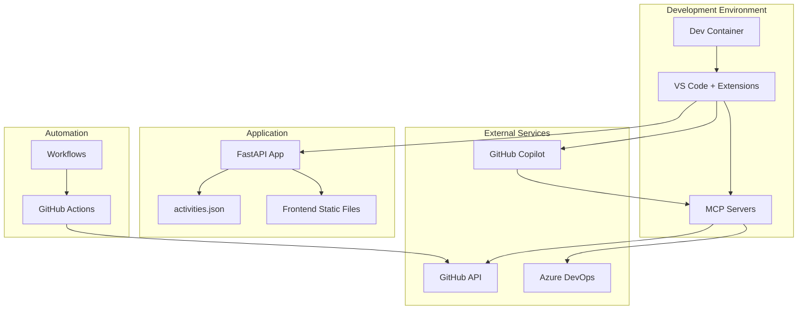

# Project Structure

## Directory Tree

```
skills-integrate-mcp-with-copilot/
│
├── .devcontainer/                    # Development Container Configuration
│   └── devcontainer.json             # Container definition with Python 3.13, Node.js, Docker
│
├── .github/                          # GitHub-specific Configuration
│   ├── steps/                        # Exercise Step Instructions
│   │   ├── 1-step-issues/            # Step 1 issue templates
│   │   ├── 1-step.md                 # Step 1: MCP introduction and setup
│   │   ├── 2-step.md                 # Step 2: Agent Mode and GitHub MCP
│   │   ├── 3-step.md                 # Step 3: Advanced features
│   │   ├── 4-step.md                 # Step 4: Completion
│   │   └── x-review.md               # Review content
│   │
│   └── workflows/                    # GitHub Actions Workflows
│       ├── 0-start-exercise.yml      # Initialize the exercise
│       ├── 1-step.yml                # Validate Step 1
│       ├── 2-step.yml                # Validate Step 2
│       ├── 3-step.yml                # Validate Step 3
│       ├── 4-step.yml                # Validate Step 4
│       └── pilot-sync-ado.yml        # Azure DevOps sync workflow
│
├── .vscode/                          # VS Code Configuration
│   ├── launch.json                   # Debug configuration for Python app
│   └── mcp.json                      # MCP server configuration
│
├── docs/                             # Documentation
│   ├── MCP_SYNC_GUIDE.md             # Azure DevOps MCP integration guide (Chinese)
│   ├── PROJECT_OVERVIEW.md           # High-level project introduction
│   ├── PROJECT_STRUCTURE.md          # This file - detailed structure
│   ├── SETUP_GUIDE.md                # Setup and installation guide
│   ├── API_REFERENCE.md              # FastAPI endpoint documentation
│   └── MCP_INTEGRATION.md            # MCP configuration and usage
│
├── src/                              # Application Source Code
│   ├── app.py                        # FastAPI application entry point
│   ├── activities.json               # Activity data storage (JSON database)
│   ├── README.md                     # Application-specific documentation
│   │
│   └── static/                       # Frontend Static Files
│       ├── index.html                # Main web page
│       ├── app.js                    # Frontend JavaScript logic
│       └── styles.css                # CSS styling
│
├── .gitignore                        # Git ignore patterns
├── LICENSE                           # MIT License
├── README.md                         # Repository welcome message
└── requirements.txt                  # Python dependencies
```

## Component Details

### 🐳 Development Container (`.devcontainer/`)

**Purpose**: Provides a consistent, containerized development environment for all contributors.

**Configuration** (`devcontainer.json`):
- **Base Image**: `mcr.microsoft.com/vscode/devcontainers/python:3.13-bookworm`
- **Features**:
  - Node.js (latest version) - for MCP servers
  - Docker-in-Docker - for container operations
- **Port Forwarding**: Port 8000 (web application)
- **Post-Create Command**: `pip install -r requirements.txt`
- **Extensions**:
  - `GitHub.copilot` - AI-powered coding assistant
  - `ms-python.python` - Python language support
  - `ms-python.debugpy` - Python debugging
  - `dbaeumer.vscode-eslint` - JavaScript linting
- **Settings**:
  - `chat.agent.enabled: true` - Enable Copilot Agent Mode
  - `chat.mcp.enabled: true` - Enable MCP integration

### 🔄 GitHub Actions (`.github/workflows/`)

**Workflow Files**:

1. **`0-start-exercise.yml`**
   - Triggers on push to `main` branch
   - Creates initial exercise issue
   - Posts step 1 instructions
   - Enables step 1 workflow

2. **`1-step.yml` through `4-step.yml`**
   - Validate completion of each exercise step
   - Check for required files and configurations
   - Post next step instructions
   - Enable subsequent workflows

3. **`pilot-sync-ado.yml`**
   - Demonstrates Azure DevOps integration
   - Syncs work items to GitHub issues
   - Uses MCP for ADO API access
   - Scheduled or manual trigger

### 🔧 VS Code Configuration (`.vscode/`)

**`launch.json`** - Debug Configuration:
```json
{
  "version": "0.2.0",
  "configurations": [
    {
      "name": "Python: FastAPI",
      "type": "debugpy",
      "request": "launch",
      "module": "uvicorn",
      "args": ["src.app:app", "--reload", "--host", "0.0.0.0"],
      "jinja": true
    }
  ]
}
```

**`mcp.json`** - MCP Server Configuration:
- **GitHub Server**: HTTP-based, connects to GitHub's Copilot MCP
- **Azure DevOps Server**: stdio-based, uses `@azure-devops/mcp` npm package
- **Inputs**: Prompts for ADO organization and PAT token
- **Environment Variables**: Configures authentication

### 📚 Documentation (`.docs/`)

**Documentation Files**:

1. **PROJECT_OVERVIEW.md** - High-level introduction and learning objectives
2. **PROJECT_STRUCTURE.md** - Detailed file and directory structure (this file)
3. **SETUP_GUIDE.md** - Step-by-step setup instructions
4. **API_REFERENCE.md** - FastAPI endpoint documentation
5. **MCP_INTEGRATION.md** - MCP configuration and usage guide
6. **MCP_SYNC_GUIDE.md** - Azure DevOps integration (Chinese language)

### 💻 Application Source (`.src/`)

**Main Application** (`app.py`):
```python
FastAPI application with:
- Activity listing endpoint: GET /activities
- Activity signup endpoint: POST /activities/{name}/signup
- Activity unregister endpoint: DELETE /activities/{name}/unregister
- Static file serving: /static/*
- Root redirect: / -> /static/index.html
- JSON-based persistence via activities.json
```

**Data Storage** (`activities.json`):
```json
{
  "Activity Name": {
    "description": "...",
    "schedule": "...",
    "max_participants": number,
    "participants": ["email1@domain.edu", ...]
  }
}
```

**Static Frontend**:
- **`index.html`**: Single-page application structure
- **`app.js`**: Fetch activities, handle signups, DOM updates
- **`styles.css`**: Modern, responsive styling

### 📝 Configuration Files (Root)

**`.gitignore`**:
```
__pycache__/
*.py[cod]
.venv/
*.log
.env
```

**`requirements.txt`**:
```
fastapi
uvicorn
```

**`LICENSE`**: MIT License (Copyright 2025 GitHub Skills)

**`README.md`**: Success page with sharing buttons and links

## File Sizes and Purposes

| File | Size (approx) | Purpose |
|------|---------------|---------|
| `devcontainer.json` | 600 bytes | Dev container setup |
| `mcp.json` | 600 bytes | MCP server configuration |
| `launch.json` | 300 bytes | VS Code debug config |
| `app.py` | 2.5 KB | FastAPI backend |
| `activities.json` | 1.5 KB | Activity data |
| `index.html` | ~3 KB | Frontend UI |
| `app.js` | ~2 KB | Frontend logic |
| `styles.css` | ~2 KB | Styling |
| Step files | 2-6 KB each | Exercise instructions |
| Workflow files | 1-3 KB each | CI/CD automation |

## Key Interactions



## Data Flow

1. **User Request** → Frontend (`index.html`)
2. **Frontend** → API Call (`app.js`)
3. **API** → FastAPI Routes (`app.py`)
4. **Routes** → JSON Storage (`activities.json`)
5. **Response** → Frontend Update

## Development Workflow

1. **Start**: Open in Codespace/Dev Container
2. **Configure**: Set up MCP in `.vscode/mcp.json`
3. **Develop**: Write code with Copilot assistance
4. **Test**: Debug using launch configuration
5. **Commit**: Push changes trigger workflows
6. **Validate**: GitHub Actions verify progress
7. **Learn**: Complete exercise steps

## Extension Points

The project structure supports several extension possibilities:

- **Additional MCP Servers**: Add more servers to `mcp.json`
- **More Activities**: Extend `activities.json` structure
- **Database Migration**: Replace JSON with PostgreSQL/MongoDB
- **Authentication**: Add user authentication system
- **Admin Panel**: Create management interface
- **API Versioning**: Add `/v1/` prefix to endpoints
- **Testing**: Add `tests/` directory with pytest
- **CI/CD**: Extend workflows for deployment

## Dependencies

### Python Dependencies
- `fastapi` - Web framework
- `uvicorn` - ASGI server

### Node.js Dependencies (MCP)
- `@azure-devops/mcp` - Azure DevOps MCP server
- `npx` - Package runner (for MCP servers)

### VS Code Extensions
- GitHub Copilot
- Python
- debugpy
- ESLint

## Maintenance Notes

- **Data Persistence**: `activities.json` is tracked in Git - changes persist
- **Secrets Management**: Use environment variables or `.env` (not tracked)
- **Version Updates**: Keep MCP servers and dependencies current
- **Documentation**: Update docs when adding features
- **Testing**: Manual testing via web interface at http://localhost:8000
